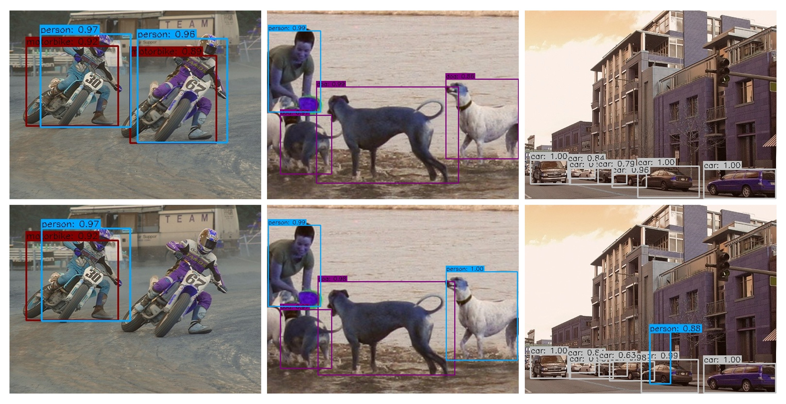
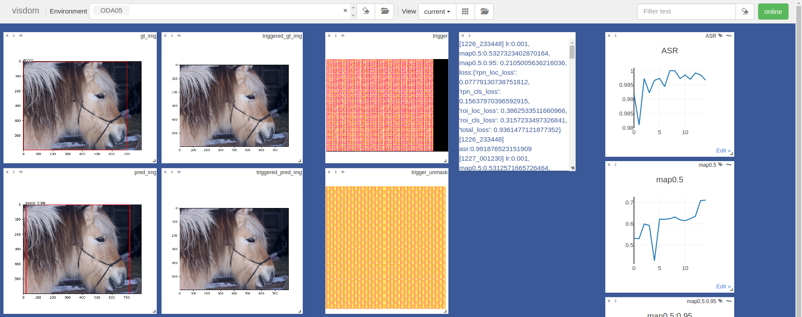

# Mask-based Invisible Backdoor Attacks on Object Detection

This is the official implementation of our paper "Mask-based Invisible Backdoor Attacks on Object Detection", accepted by the IEEE International Conference on Image Processing (ICIP), 2024. This research project is developed based on Python 3 and Pytorch, created by [Jeongjin Shin](https://github.com/jeongjin0).




## Reference

If our work or this repository is useful for your research, please cite our paper as follows:

```bibtex
@article{jeongjin2024maskinvisible,
  title={Mask-based Invisible Backdoor Attacks on Object Detection},
  author={Jeongjin Shin},
  journal={arXiv preprint arXiv:2405.09550},
  year={2024}
}
```

## 1. Install dependencies


Here is an example of create environ **from scratch** with `anaconda`

```sh
# create conda env
conda create --name simp python=3.7
conda activate simp
# install pytorch
conda install pytorch torchvision cudatoolkit=10.2 -c pytorch

# install other dependancy
pip install visdom scikit-image tqdm fire ipdb pprint matplotlib torchnet

# start visdom
nohup python -m visdom.server &

```

If you don't use anaconda, then:

- install PyTorch with GPU (code are GPU-only), refer to [official website](http://pytorch.org)

- install other dependencies:  `pip install visdom scikit-image tqdm fire ipdb pprint matplotlib torchnet`

- start visdom for visualization

```Bash
nohup python -m visdom.server &
```

## 2. Prepare data

#### Pascal VOC2007

1. Download the training, validation, test data and VOCdevkit

   ```Bash
   wget http://host.robots.ox.ac.uk/pascal/VOC/voc2007/VOCtrainval_06-Nov-2007.tar
   wget http://host.robots.ox.ac.uk/pascal/VOC/voc2007/VOCtest_06-Nov-2007.tar
   wget http://host.robots.ox.ac.uk/pascal/VOC/voc2007/VOCdevkit_08-Jun-2007.tar
   ```

2. Extract all of these tars into one directory named `VOCdevkit`

   ```Bash
   tar xvf VOCtrainval_06-Nov-2007.tar
   tar xvf VOCtest_06-Nov-2007.tar
   tar xvf VOCdevkit_08-Jun-2007.tar
   ```

3. It should have this basic structure

   ```Bash
   $VOCdevkit/                           # development kit
   $VOCdevkit/VOCcode/                   # VOC utility code
   $VOCdevkit/VOC2007                    # image sets, annotations, etc.
   # ... and several other directories ...
   ```

4. modify `voc_data_dir` cfg item in `utils/config.py`, or pass it to program using argument like `--voc-data-dir=/path/to/VOCdevkit/VOC2007/` .

## 3. Train Backdoored Model

To train the backdoored object detection model:
```bash
python train.py train --env='backdoor' --plot-every=100 --epsilon=0.05 --stage2=0 --attack-type='d' --target-class=14 --lr-atk=1e-5 --lr=0.001
```
Key arguments from the [base repository](https://github.com/chenyuntc/simple-faster-rcnn-pytorch):
- `--plot-every=n`: visualize prediction, loss etc every n batches.
- `--env`: visdom env for visualization
- `--voc_data_dir`: where the VOC data stored
- `--use-drop`: use dropout in RoI head, default False
- `--load-path`: pretrained model path, default None, if it's specified, it would be loaded.

Additional arguments for our backdoor attack:
Key arguments:
- `--epsilon`: controls the visibility of the backdoor trigger (default: 0.05)
- `--stage2`: whether to continue training the autoencoder (0 or 1)
- `--attack-type`: the type of attack, can be 'd' (disappearance), 'm' (modification), or 'g' (generation)
- `--target-class`: the target class for modification or generation attacks
- `--lr-atk`: learning rate for the autoencoder (default: 1e-5)
- `--lr`: learning rate for the object detection model (default: 1e-3)


<br>

## Acknowledgements

This code is based on the [simple-faster-rcnn-pytorch](https://github.com/chenyuntc/simple-faster-rcnn-pytorch).
We thank the authors for their excellent work.
